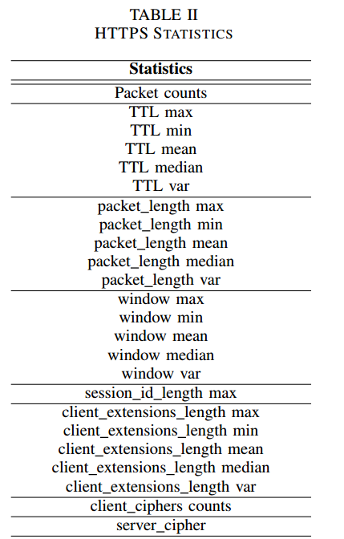
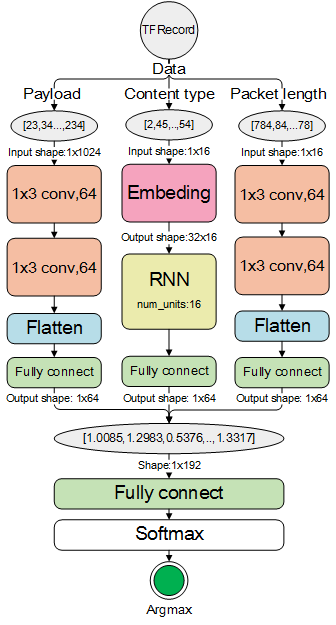
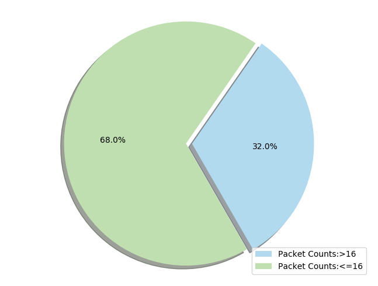
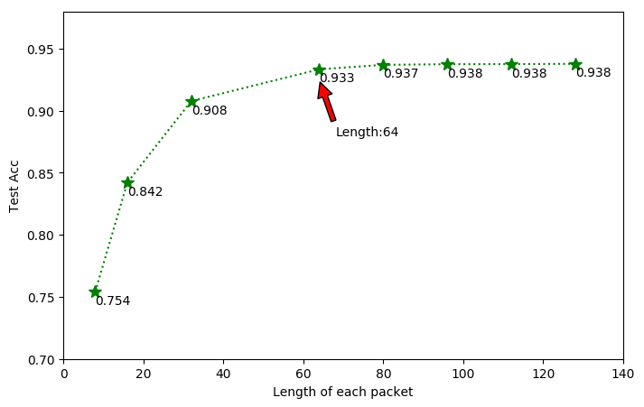
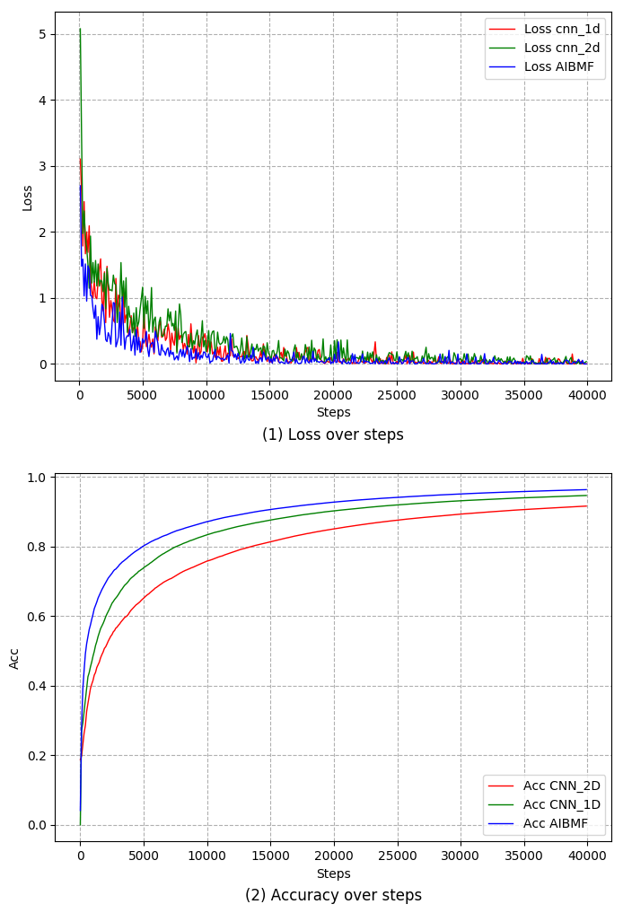
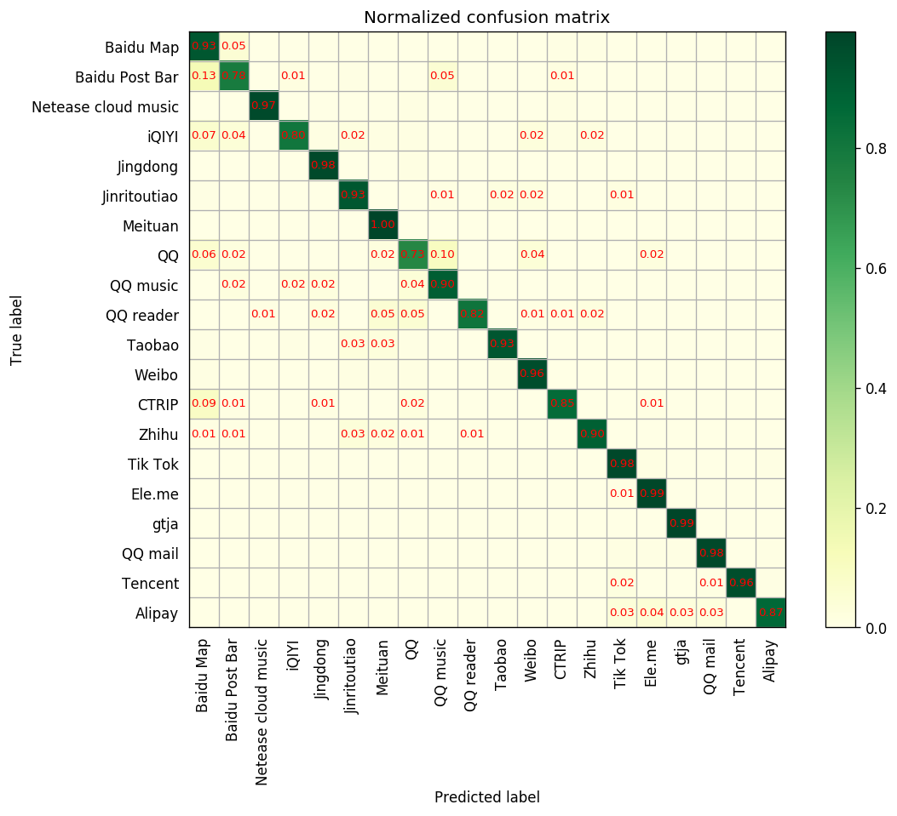
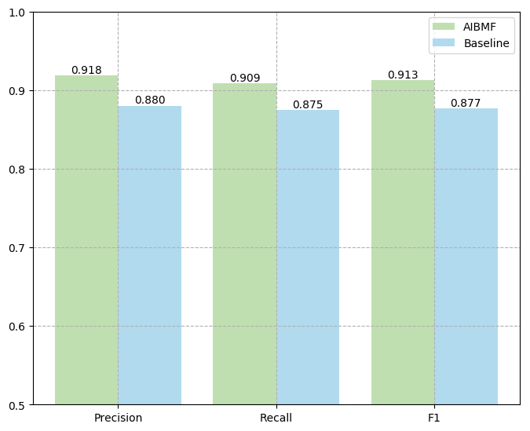

# HTTPS流量识别

## 0.HTTPS流量识别任务概述

本研究主要是对Android端应用产生的HTTPS流量进行识别，比如：一个流量数据中可能混合了多个应用的流量，如网易云音乐，爱奇艺等应用的HTTPS流，本文的工作是为了识别出当前一条HTTPS是由哪一个应用产生，属于细粒度的流量识别工作。

## 1.HTTPS流量数据采集

### （1）流量采集环境

- 使用Windows笔记本虚拟网卡采集Android真机

  - 虚拟Windows网卡（使用Windows开wifi）

    ```sh
    # 运行下面的命令检查，显示“支持的承载网络：是（如果支持显示为：是）”；如果为“否”，则请略过本文。
    netsh wlan show drivers
    # 设置虚拟wifi的ID和密码，之后在网络适配器中将以太网的Adapter共享给新增加的虚拟Adapter
    netsh wlan set hostednetwork mode=allow ssid=test key=test
    # 开启虚拟wifi
    netsh wlan start hostednetwork
    # 关闭wifi
    netsh wlan set hostednetwork mode=disallow
    ```

- 使用模拟器+tcpdump采集

- monkeyrunner脚本

由于流量识别任务对流量的数据规模要求大，完全依靠人工运行Android应用不实际，本项目借助monkeyrunner工具自动运行，通过monkeyrunner对操作进行录制，然后使用Python加载操作记录，自动运行Android程序，可以在采集不同时段的流量。

本项目当前抓取的流量流量规模为20个移动应用10万条数据，如下图：


## 2.提取流

- 抽取流

本项目使用五元组【源地址，目的地址，源端口，目的端口，协议类型】来提取pcap文件中的流，将每一条流保存问一个文件。每一条流对应的pcap文件保存命名格式如下：


- Powershell脚本

## 3.预处理，统计特征

- TFRecord格式文件

提取了一条流的前16个packet进行处理，分别提取content type，payload，packet size，将结果存储为TFrecord。格式如下：

```python
def wrap_int64(value):
    return tf.train.Feature(int64_list=tf.train.Int64List(value=[value]))
def wrap_array(value):
    return tf.train.Feature(int64_list=tf.train.Int64List(value=value))
def wrap_bytes(value):
    return tf.train.Feature(bytes_list=tf.train.BytesList(value=[value]))

def convert(pcap_files, out_path):
    print("Converting: " + out_path)
    num = len(pcap_files)
    with tf.python_io.TFRecordWriter(out_path) as writer:
        i=0
        for pacp_file in pcap_files:
            print_progress(i, num)
            recordTypes, packetLength, packetPayload, label = packet_parse(pacp_file)
            example = tf.train.Example(features=tf.train.Features(
                feature={'recordTypes': wrap_array(recordTypes),
                         'packetLength': wrap_array(packetLength),
                         'packetPayload': wrap_array(packetPayload),
                         'label': wrap_int64(label)
                         }))
            serialized = example.SerializeToString()
            writer.write(serialized)
            i = i + 1
```

- 使用scapy包提取HTTPS流对应的统计特征，主要是对处理了time和zise相关的统计特征（均值，中值，方差等），如下图：



## 4. 深度学习模型，识别任务

- 使用一维卷积神经网络处理Payload
- 对content type进行embedding，之后输入RNN，LSTM，GRU
- 对packet length使用一维卷积神经网络提取特征
- 综合三个视角的抽象特征，完成识别任务



## 5.实验

- 确定超参数：一条流的packet数目，每一个packet的payload部分使用的字节数

  - packet数目（对10万条流进行统计）

    

  - 每一条流使用16个packet包，使用对比实验，每一个packet分别取不同数目的payload进行实验

  

- 训练模型

  

- 针对20个应用进行识别(混淆矩阵)



- 与baseline对比



## 6.论文

[论文原文](./images/1570516549.pdf)

## 7.彩蛋

- Python绘图：[我的博客](http://www.damaoguo.site/2018/10/05/graph-drawing/)