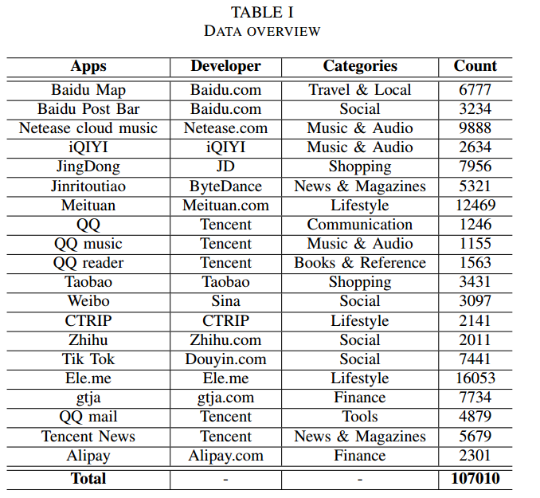
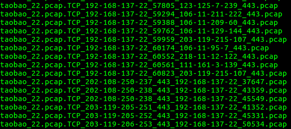

# HTTPS流量识别

## 0.HTTPS流量识别任务概述

本研究主要是对Android端应用产生的HTTPS流量进行识别，比如：一个流量数据中可能混合了多个应用的流量，如网易云音乐，爱奇艺等应用的HTTPS流，本文的工作是为了识别出当前一条HTTPS是由哪一个应用产生，属于细粒度的流量识别工作。

## 1.HTTPS流量数据采集

### （1）流量采集环境

- 使用Windows笔记本虚拟网卡采集Android真机

  - 虚拟Windows网卡（使用Windows开wifi）

    ```sh
    # 运行下面的命令检查，显示“支持的承载网络：是（如果支持显示为：是）”；如果为“否”，则请略过本文。
    netsh wlan show drivers
    # 设置虚拟wifi的ID和密码，之后在网络适配器中将以太网的Adapter共享给新增加的虚拟Adapter
    netsh wlan set hostednetwork mode=allow ssid=test key=test
    # 开启虚拟wifi
    netsh wlan start hostednetwork
    # 关闭wifi
    netsh wlan set hostednetwork mode=disallow
    ```

- 使用模拟器+tcpdump采集

- monkeyrunner脚本

由于流量识别任务对流量的数据规模要求大，完全依靠人工运行Android应用不实际，本项目借助monkeyrunner工具自动运行，通过monkeyrunner对操作进行录制，然后使用Python加载操作记录，自动运行Android程序，可以在采集不同时段的流量。

本项目当前抓取的流量流量规模为20个移动应用10万条数据，如下图：




## 2.提取流

- 抽取流

本项目使用五元组【源地址，目的地址，源端口，目的端口，协议类型】来提取pcap文件中的流，将每一条流保存问一个文件。每一条流对应的pcap文件保存命名格式如下：



- Powershell脚本

## 3.预处理，统计特征


## 4. 深度学习模型，识别任务


## 5.实验

## 6.论文